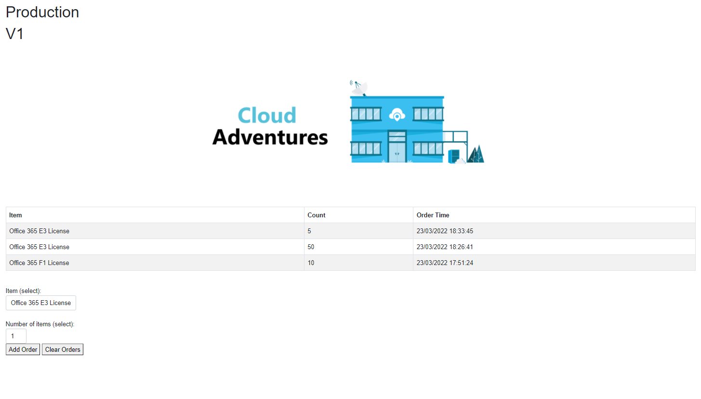
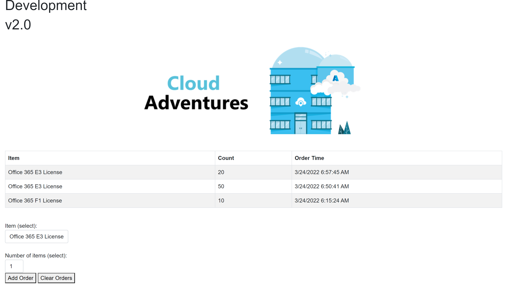

| Branch | Status |
| ------------- | ------------- |
| main  |   |
| main  |   |
| dev  |   |
| dev  |   |

# Cloud Adventures Deployments

## Web App
The Web App contains a Blazor .Net 6 solution that mimics the functionality of an ordering system. Orders can be added or cleared. The solution holds no state and upon refreshing the page, the page is populated with orders. 

The Bicep files for the Web App deploy an App Service Plan and two App Services. A regular production App Service and a Dev deployment slot. Both slots have different app settings. Important settings for the demo are:

- EnvType (slot setting)
- SolutionVersion
- image

The EnvType and Solution Version are shown on the page itself (Production: V1). When performing the demo, upon swapping the EnvType should remain as this is a slot setting and the SolutionVersion should change to whatever the version is in the App Setting of the Dev slot. The goal is to demo going back and forth between versions using the Slot Swap Functionality.

The image app setting is a strange one. We can do it without but that requires pushing code to the Deployment Slot during a demo. If you do not feel comfortable with this, the App Setting "image" contains the path to the image for that slot. Swapping the solution also swaps the value and will change the image (however, this is not really swapping as we can change the value and achieve the same result). For a demo it doesn't matter, it would still show how the feature "slot swapping" works.

### GitHub Actions
The GitHub action will deploy the solution to the Cloud Adventures Internal subscription and deploy the code to the different slots (Please clean up after)

Sample Production Demo:

Sample Development Demo:
